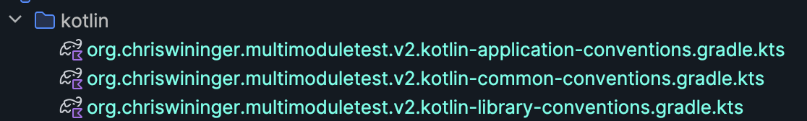

Breaking Down a Multi-Project Gradle Application
=================================================

I have experience with maven and npm, but am very new to gradle.
I find most of the generated gradle projects and templates confusing,
so I wanted to strip one down to only the most important parts. 

I created [my-multi-module-test-v2](./my-multi-module-test-v2) using `gradle init`. In my notes below I will document
what is found their.

[my-multi-module-test-v3](./my-multi-module-test-v3) is a re-creation of the project stripping out anything that's not
strictly needed to build and run the project and disregarding more advanced features, that while likely better for
production can be confusing to someone new to gradle.

## Videos

* [Breaking Down a Multi-Project Gradle Application - Part I](https://youtu.be/29fiyZ2RAvk):
  Explains [my-multi-module-test-v2](./my-multi-module-test-v2)
* [Breaking Down a Multi-Project Gradle Application - Part II](https://youtu.be/lGyG8M9jfkc):
  Walks through the creation of [my-multi-module-test-v3](./my-multi-module-test-v3)

## Notes On [my-multi-module-test-v2](./my-multi-module-test-v2)

Run `gradle init`, when asked say yes to multiple sub-projects

### Notice
* There are 3 sub-projects:
    * app
    * list,
    * utilities
*  At the root there is **no build.gradle or build.gradle.kts*** files
*  There is only:
    *  `settings.gradle.kts`
    * gradle wrapper related files and directories

### Root settings.gradle.kts

```
plugins {
    // Apply the foojay-resolver plugin to allow automatic download of JDKs
    id("org.gradle.toolchains.foojay-resolver-convention") version "0.7.0"
}

rootProject.name = "my-muli-module-test-v2"
include("app", "list", "utilities")
```

* The main things we really need here are the `include` and the `rootProject.name`, the plugin is probably
  a nice to have

### List

* The list project contains a linked list implementation, written in Kotlin
* The build.gradle.kts looks like:

```
plugins {
    id("org.chriswininger.multimoduletest.v2.kotlin-library-conventions")
}
```

### Utilities Directory

The Utilities project contains some libraries for processing strings and lists

The build.gradle.kts file looks like:

```
plugins {
    id("org.chriswininger.multimoduletest.v2.kotlin-library-conventions")
}

dependencies {
    api(project(":list"))
}  
```

* Notice that it specifies `":list"` as  a dependency. This is a little different than how we specified proeject to
  project dependencies in [the pluralsight tutorial](https://app.pluralsight.com/library/courses/gradle-build-tool-fundamentals),
  where they defined this at the top level

### App directory

* This specifies the application project, it pulls in a plugin defined in [buildSrc](./my-multi-module-test-v2/buildSrc),
some additional dependencies, and sets the main class name.

```
/*
 * This file was generated by the Gradle 'init' task.
 */

plugins {
    id("org.chriswininger.multimoduletest.v2.kotlin-application-conventions")
}

dependencies {
    implementation("org.apache.commons:commons-text")
    implementation(project(":utilities"))
}

application {
    // Define the main class for the application.
    mainClass.set("org.chriswininger.multimoduletest.v2.app.AppKt")
}
```

### What is buildSrc?

*Complex build logic is usually a good candidate for being encapsulated either as custom task or
binary plugin. Custom task and plugin implementations should not live in the build script. It is very convenient to
use buildSrc for that purpose as long as the code does not need to be shared among multiple, independent projects.
The directory buildSrc is treated as an included build. Upon discovery of the directory, Gradle automatically
compiles and tests this code and puts it in the classpath of your build script. For multi-project builds there can
be only one buildSrc directory, which has to sit in the root project directory. buildSrc should be preferred over script
plugins as it is easier to maintain, refactor and test the code.*

-- https://github.com/chriswininger/breaking-down-a-multi-project-gradle-application

### org.chriswininger.multimoduletest.v2.kotlin-library-conventions

* This seems to come from the buildSrc directory which has it's own `build.gradle.kts`, `settings.gradle.kts`,
  and several `.kts` files



* There is are `common-conventions`, `library-conventions`, and `application-conventions` kts files.
* The library and application convention files both include `common-conventions` as a plugin

### org.chriswininger.multimoduletest.v2.kotlin-common-conventions.gradle.kts

* This is where we include much of the standard configuration, for example this is where we pull in the kotlin plugin

```
plugins {
    // Apply the org.jetbrains.kotlin.jvm Plugin to add support for Kotlin.
    id("org.jetbrains.kotlin.jvm")
}
```

as well as setup the repository

```
repositories {
    // Use Maven Central for resolving dependencies.
    mavenCentral()
}
```

we also pull in shared dependencies here:

```
dependencies {
    constraints {
        // Define dependency versions as constraints
        implementation("org.apache.commons:commons-text:1.10.0")
    }

    // Use JUnit Jupiter for testing.
    testImplementation("org.junit.jupiter:junit-jupiter:5.10.0")

    testRuntimeOnly("org.junit.platform:junit-platform-launcher")
}
```

The full file looks like:

```
/*
 * This file was generated by the Gradle 'init' task.
 */

plugins {
    // Apply the org.jetbrains.kotlin.jvm Plugin to add support for Kotlin.
    id("org.jetbrains.kotlin.jvm")
}

repositories {
    // Use Maven Central for resolving dependencies.
    mavenCentral()
}

dependencies {
    constraints {
        // Define dependency versions as constraints
        implementation("org.apache.commons:commons-text:1.10.0")
    }

    // Use JUnit Jupiter for testing.
    testImplementation("org.junit.jupiter:junit-jupiter:5.10.0")

    testRuntimeOnly("org.junit.platform:junit-platform-launcher")
}

// Apply a specific Java toolchain to ease working on different environments.
java {
    toolchain {
        languageVersion.set(JavaLanguageVersion.of(17))
    }
}

tasks.named<Test>("test") {
    // Use JUnit Platform for unit tests.
    useJUnitPlatform()
}
```

## Steps to Create [my-multi-module-test-v3](./my-multi-module-test-v3)

I created a utility function to help me

```
function caw_gradle_create_sub_project_directories() {
   project_name=$1

   mkdir -p "./$project_name/src/main/kotlin/com"
   mkdir -p "./$project_name/src/main/kotlin/resources"

   mkdir -p "./$project_name/src/test/kotlin/com"
   mkdir -p "./$project_name/src/test/kotlin/resources"
}
```

* `mkdir ./my-multi-module-test-v3`
*  `cd ./my-multi-module-test-v3`
* `touch ./settings.gradle.kts`
* `gradle wrapper --gradle-version 8.5`
* `caw_gradle_create_sub_project_directories app`
* `caw_gradle_create_sub_project_directories list`
* `caw_gradle_create_sub_project_directories utilties`
* Open in Idea
* Edit the settings.gradle.kts

```
rootProject.name = "my-multi-module-test-v3"
include("app", "list", "utilities")
```
* create the package structures
```
mkdir -p ./app/src/main/kotlin/org/chriswininger/multimoduletest/v3/app           
mkdir -p ./list/src/main/kotlin/org/chriswininger/multimoduletest/v3/list          
mkdir -p ./utilities/src/main/kotlin/org/chriswininger/multimoduletest/v3/utilities
```
* Copy the classes and update package to v3 in the files
* Create a build.gradle.kts file in ./app
* It should look like this:
```
plugins {
  kotlin("jvm") version "1.5.30"
  `kotlin-dsl`
  application
}

repositories {
  // Use the plugin portal to apply community plugins in convention plugins.
  gradlePluginPortal()
  mavenCentral()
}

dependencies {
  implementation("org.apache.commons:commons-text:1.10.0")
  implementation(project(":utilities"))
}

java {
  toolchain {
    languageVersion.set(JavaLanguageVersion.of(17))
  }
}

application {
  mainClass.set("org.chriswininger.multimoduletest.v3.app.AppKt")
}
```
* Now create one for lists, with the following:

```
plugins {
  kotlin("jvm") version "1.5.30"
  `kotlin-dsl`
  `java-library`
}

repositories {
  // Use the plugin portal to apply community plugins in convention plugins.
  gradlePluginPortal()
  mavenCentral()
}

dependencies {
  implementation("org.apache.commons:commons-text:1.10.0")
}

java {
  toolchain {
    languageVersion.set(JavaLanguageVersion.of(17))
  }
}
```

* Finally utilities looks like:

```
plugins {
  kotlin("jvm") version "1.5.30"
  `kotlin-dsl`
  `java-library`
}

repositories {
  // Use the plugin portal to apply community plugins in convention plugins.
  gradlePluginPortal()
  mavenCentral()
}

dependencies {
  implementation("org.apache.commons:commons-text:1.10.0")
  api(project(":list"))
}

java {
  toolchain {
    languageVersion.set(JavaLanguageVersion.of(17))
  }
}
```
